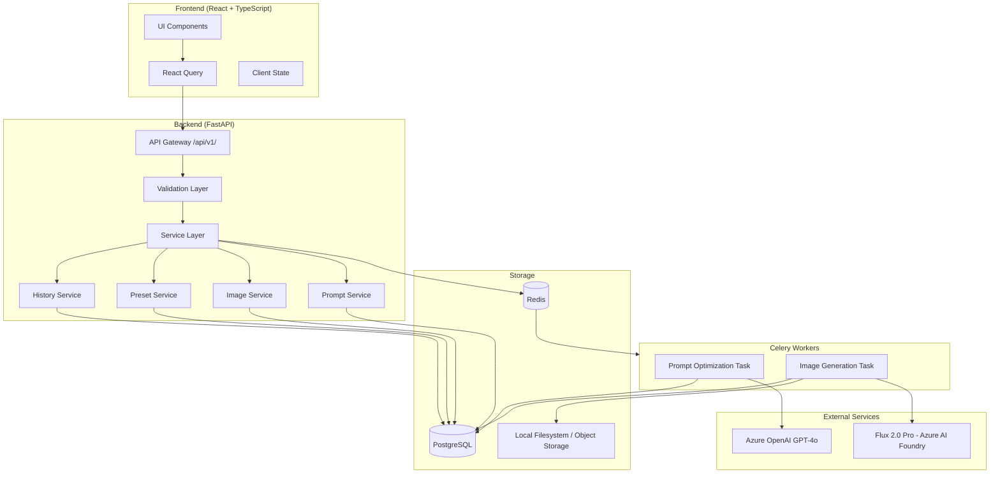
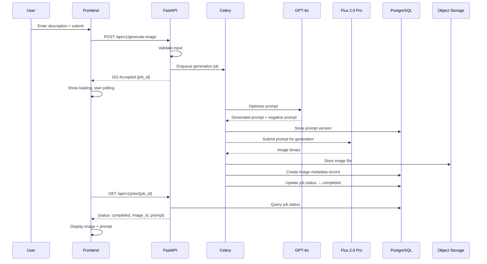
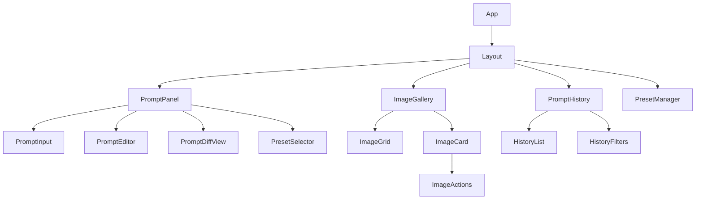
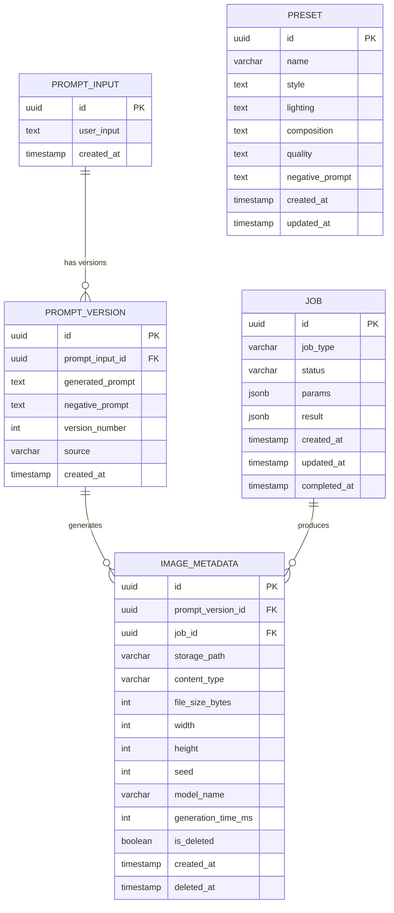
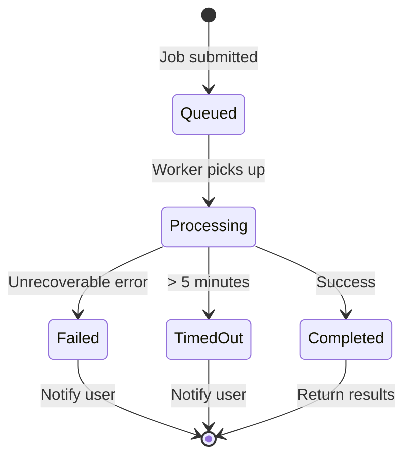

# Design Document: AI Image Generation Platform

## Overview

The AI Image Generation Platform is a full-stack web application that enables users to generate high-quality images from natural language descriptions. The system orchestrates a pipeline: user input → prompt optimization via Azure OpenAI GPT-4o → image generation via Flux 2.0 Pro (Azure AI Foundry) → storage and presentation.

The architecture follows a layered design with clear separation of concerns:
- **Frontend (React + TypeScript)**: SPA handling user interaction, prompt editing, gallery management
- **Backend (Python FastAPI)**: REST API orchestrating business logic, validation, and service coordination
- **Async Workers (Celery + Redis)**: Background processing for long-running image generation tasks
- **Database (PostgreSQL)**: Persistent storage for prompts, versions, presets, job metadata
- **Object Storage (Local filesystem for MVP)**: Binary image storage with cloud migration path

Key design decisions:
- Async-first architecture using Celery to prevent API blocking during generation (30-60s per image)
- Model abstraction layer enabling future model swaps without code changes
- Prompt versioning as first-class concept enabling iteration and transparency
- Polling-based status updates (simpler than WebSockets for MVP)

## Architecture

### System Architecture Diagram



### Request Flow: Image Generation



### Key Architectural Decisions

| Decision | Choice | Rationale |
|----------|--------|-----------|
| Async processing | Celery + Redis | Image generation takes 30-60s; must not block API |
| Status updates | Polling (2s interval) | Simpler than WebSockets for MVP; sufficient latency |
| Prompt storage | Versioned records | Enables history, comparison, and iteration |
| Model abstraction | Adapter pattern | Future model swaps without touching business logic |
| API versioning | URL prefix /api/v1/ | Clear, explicit versioning; easy to support multiple versions |
| Object storage | Local filesystem (MVP) | Simplifies development; abstracted for cloud migration |
| No auth (MVP) | Deferred | Simplifies initial implementation; all data treated as single-user |

## Components and Interfaces

### Backend Components

#### 1. API Layer (`app/api/`)

**Router modules** exposing versioned endpoints:

```python
# POST /api/v1/generate-image
class GenerateImageRequest(BaseModel):
    prompt: str = Field(..., min_length=1, max_length=2000)
    num_variations: int = Field(default=1, ge=1, le=4)
    preset_id: Optional[UUID] = None

class GenerateImageResponse(BaseModel):
    job_id: UUID
    status: str  # "queued"

# GET /api/v1/jobs/{job_id}
class JobStatusResponse(BaseModel):
    job_id: UUID
    status: str  # queued | processing | completed | failed | timed_out
    created_at: datetime
    completed_at: Optional[datetime]
    results: Optional[List[ImageResult]]
    error: Optional[ErrorDetail]

# POST /api/v1/regenerate
class RegenerateRequest(BaseModel):
    image_id: UUID
    edited_prompt: Optional[str] = None  # None = same prompt, new seed

# GET /api/v1/history
class HistoryResponse(BaseModel):
    items: List[PromptHistoryItem]
    total: int
    page: int
    page_size: int

# POST /api/v1/refine-prompt
class RefinePromptRequest(BaseModel):
    prompt_version_id: UUID
    edited_text: str = Field(..., min_length=1, max_length=5000)

# GET /api/v1/images/{id}
# Returns image binary with caching headers

# PUT /api/v1/prompts/{id}
class UpdatePromptRequest(BaseModel):
    text: str = Field(..., min_length=1, max_length=5000)

# CRUD /api/v1/presets
class PresetRequest(BaseModel):
    name: str = Field(..., min_length=1, max_length=100)
    style: Optional[str] = None
    lighting: Optional[str] = None
    composition: Optional[str] = None
    quality: Optional[str] = None
    negative_prompt: Optional[str] = None
```

#### 2. Service Layer (`app/services/`)

**PromptService**: Handles prompt optimization, versioning, and retrieval.

```python
class PromptService:
    async def optimize_prompt(self, user_input: str, preset: Optional[Preset]) -> PromptVersion:
        """Call GPT-4o to enhance the user input into a detailed prompt."""
    
    async def create_version(self, original_input_id: UUID, text: str, source: str) -> PromptVersion:
        """Create a new prompt version (from optimization or user edit)."""
    
    async def get_history(self, page: int, page_size: int, filters: HistoryFilters) -> PaginatedResult:
        """Retrieve paginated prompt history with optional filters."""
    
    async def get_version(self, version_id: UUID) -> PromptVersion:
        """Retrieve a specific prompt version."""
```

**ImageService**: Manages image generation orchestration and storage.

```python
class ImageService:
    async def generate(self, prompt_version_id: UUID, num_variations: int, seed: Optional[int]) -> List[UUID]:
        """Submit generation jobs to Celery and return job IDs."""
    
    async def store_image(self, image_binary: bytes, metadata: ImageMetadata) -> UUID:
        """Store image to object storage and create DB record."""
    
    async def get_image(self, image_id: UUID) -> Tuple[bytes, str]:
        """Retrieve image binary and content type."""
    
    async def delete_image(self, image_id: UUID) -> None:
        """Soft-delete image (mark metadata, remove from storage)."""
```

**JobService**: Tracks async job lifecycle.

```python
class JobService:
    async def create_job(self, job_type: str, params: dict) -> Job:
        """Create a new job record."""
    
    async def update_status(self, job_id: UUID, status: str, result: Optional[dict]) -> Job:
        """Update job status and optional result payload."""
    
    async def get_job(self, job_id: UUID) -> Job:
        """Get job status and results."""
    
    async def get_user_jobs(self, status_filter: Optional[str]) -> List[Job]:
        """List all jobs, optionally filtered by status."""
    
    async def timeout_stale_jobs(self) -> int:
        """Mark jobs processing > 5 minutes as timed_out."""
```

**PresetService**: CRUD operations for user presets.

```python
class PresetService:
    async def create_preset(self, data: PresetRequest) -> Preset:
        """Create a new preset (max 20 per user)."""
    
    async def update_preset(self, preset_id: UUID, data: PresetRequest) -> Preset:
        """Update an existing preset."""
    
    async def delete_preset(self, preset_id: UUID) -> None:
        """Delete a preset."""
    
    async def list_presets(self) -> List[Preset]:
        """List all presets for the user."""
```

#### 3. Model Abstraction Layer (`app/generators/`)

```python
from abc import ABC, abstractmethod

class ImageGeneratorBase(ABC):
    """Abstract base class for image generation models."""
    
    @abstractmethod
    async def generate(self, request: GenerationRequest) -> GenerationResult:
        """Generate an image from the given request."""
        pass
    
    @abstractmethod
    def get_supported_dimensions(self) -> List[Tuple[int, int]]:
        """Return supported image dimensions."""
        pass
    
    @abstractmethod
    def get_model_name(self) -> str:
        """Return the model identifier."""
        pass

@dataclass
class GenerationRequest:
    prompt: str
    negative_prompt: Optional[str] = None
    width: int = 1024
    height: int = 1024
    seed: Optional[int] = None

@dataclass
class GenerationResult:
    image_data: bytes
    content_type: str  # "image/png"
    model_name: str
    generation_time_ms: int
    seed_used: int

class FluxProGenerator(ImageGeneratorBase):
    """Flux 2.0 Pro implementation via Azure AI Foundry REST API."""
    
    def __init__(self, endpoint_url: str, api_key: str):
        self.endpoint_url = endpoint_url
        self.api_key = api_key
    
    async def generate(self, request: GenerationRequest) -> GenerationResult:
        """Submit prompt to Flux 2.0 Pro endpoint and return result."""
        pass
```

#### 4. Celery Tasks (`app/tasks/`)

```python
@celery_app.task(bind=True, max_retries=3)
def generate_image_task(self, job_id: str, prompt_version_id: str, seed: int):
    """
    Async task that:
    1. Retrieves prompt version from DB
    2. Calls Flux 2.0 Pro via model abstraction layer
    3. Stores resulting image
    4. Updates job status
    """
    pass

@celery_app.task(bind=True, max_retries=3)
def optimize_prompt_task(self, job_id: str, user_input: str, preset_id: Optional[str]):
    """
    Async task that:
    1. Calls GPT-4o for prompt optimization
    2. Stores prompt version
    3. Triggers image generation task(s)
    """
    pass
```

### Frontend Components

#### Component Hierarchy



#### Key Frontend Interfaces

```typescript
// API Client types
interface GenerateImageParams {
  prompt: string;
  numVariations: number;
  presetId?: string;
}

interface JobStatus {
  jobId: string;
  status: 'queued' | 'processing' | 'completed' | 'failed' | 'timed_out';
  createdAt: string;
  completedAt?: string;
  results?: ImageResult[];
  error?: ErrorDetail;
}

interface ImageResult {
  imageId: string;
  promptVersionId: string;
  generatedPrompt: string;
  negativePrompt?: string;
  seed: number;
  thumbnailUrl: string;
  fullUrl: string;
}

interface PromptVersion {
  id: string;
  originalInput: string;
  generatedPrompt: string;
  negativePrompt?: string;
  versionNumber: number;
  source: 'optimization' | 'user_edit';
  createdAt: string;
}

interface Preset {
  id: string;
  name: string;
  style?: string;
  lighting?: string;
  composition?: string;
  quality?: string;
  negativePrompt?: string;
}
```

## Data Models

### Database Schema (PostgreSQL)



### SQLAlchemy Models

```python
class PromptInput(Base):
    __tablename__ = "prompt_inputs"
    
    id: Mapped[UUID] = mapped_column(primary_key=True, default=uuid4)
    user_input: Mapped[str] = mapped_column(Text, nullable=False)
    created_at: Mapped[datetime] = mapped_column(default=func.now())
    
    versions: Mapped[List["PromptVersion"]] = relationship(back_populates="prompt_input")

class PromptVersion(Base):
    __tablename__ = "prompt_versions"
    
    id: Mapped[UUID] = mapped_column(primary_key=True, default=uuid4)
    prompt_input_id: Mapped[UUID] = mapped_column(ForeignKey("prompt_inputs.id"))
    generated_prompt: Mapped[str] = mapped_column(Text, nullable=False)
    negative_prompt: Mapped[Optional[str]] = mapped_column(Text, nullable=True)
    version_number: Mapped[int] = mapped_column(nullable=False)
    source: Mapped[str] = mapped_column(String(20), nullable=False)  # "optimization" | "user_edit"
    created_at: Mapped[datetime] = mapped_column(default=func.now())
    
    prompt_input: Mapped["PromptInput"] = relationship(back_populates="versions")
    images: Mapped[List["ImageMetadata"]] = relationship(back_populates="prompt_version")

class Job(Base):
    __tablename__ = "jobs"
    
    id: Mapped[UUID] = mapped_column(primary_key=True, default=uuid4)
    job_type: Mapped[str] = mapped_column(String(50), nullable=False)
    status: Mapped[str] = mapped_column(String(20), nullable=False, default="queued")
    params: Mapped[dict] = mapped_column(JSONB, nullable=True)
    result: Mapped[Optional[dict]] = mapped_column(JSONB, nullable=True)
    created_at: Mapped[datetime] = mapped_column(default=func.now())
    updated_at: Mapped[datetime] = mapped_column(default=func.now(), onupdate=func.now())
    completed_at: Mapped[Optional[datetime]] = mapped_column(nullable=True)
    
    images: Mapped[List["ImageMetadata"]] = relationship(back_populates="job")

class ImageMetadata(Base):
    __tablename__ = "image_metadata"
    
    id: Mapped[UUID] = mapped_column(primary_key=True, default=uuid4)
    prompt_version_id: Mapped[UUID] = mapped_column(ForeignKey("prompt_versions.id"))
    job_id: Mapped[UUID] = mapped_column(ForeignKey("jobs.id"))
    storage_path: Mapped[str] = mapped_column(String(500), nullable=False)
    content_type: Mapped[str] = mapped_column(String(50), default="image/png")
    file_size_bytes: Mapped[int] = mapped_column(nullable=False)
    width: Mapped[int] = mapped_column(nullable=False)
    height: Mapped[int] = mapped_column(nullable=False)
    seed: Mapped[int] = mapped_column(nullable=False)
    model_name: Mapped[str] = mapped_column(String(100), nullable=False)
    generation_time_ms: Mapped[int] = mapped_column(nullable=False)
    is_deleted: Mapped[bool] = mapped_column(default=False)
    created_at: Mapped[datetime] = mapped_column(default=func.now())
    deleted_at: Mapped[Optional[datetime]] = mapped_column(nullable=True)
    
    prompt_version: Mapped["PromptVersion"] = relationship(back_populates="images")
    job: Mapped["Job"] = relationship(back_populates="images")

class Preset(Base):
    __tablename__ = "presets"
    
    id: Mapped[UUID] = mapped_column(primary_key=True, default=uuid4)
    name: Mapped[str] = mapped_column(String(100), nullable=False)
    style: Mapped[Optional[str]] = mapped_column(Text, nullable=True)
    lighting: Mapped[Optional[str]] = mapped_column(Text, nullable=True)
    composition: Mapped[Optional[str]] = mapped_column(Text, nullable=True)
    quality: Mapped[Optional[str]] = mapped_column(Text, nullable=True)
    negative_prompt: Mapped[Optional[str]] = mapped_column(Text, nullable=True)
    created_at: Mapped[datetime] = mapped_column(default=func.now())
    updated_at: Mapped[datetime] = mapped_column(default=func.now(), onupdate=func.now())
```

### Storage Layout (Local Filesystem MVP)

```
/data/images/
  ├── {year}/
  │   ├── {month}/
  │   │   ├── {image_id}.png
  │   │   └── {image_id}.png
```

Path pattern: `/data/images/{YYYY}/{MM}/{image_id}.png`

This structure is abstracted behind a `StorageBackend` interface to enable future migration to cloud object storage.

```python
class StorageBackend(ABC):
    @abstractmethod
    async def store(self, key: str, data: bytes, content_type: str) -> str:
        """Store data and return the storage path."""
        pass
    
    @abstractmethod
    async def retrieve(self, path: str) -> bytes:
        """Retrieve data by storage path."""
        pass
    
    @abstractmethod
    async def delete(self, path: str) -> None:
        """Delete data at storage path."""
        pass

class LocalFilesystemStorage(StorageBackend):
    """MVP implementation using local filesystem."""
    pass

class AzureBlobStorage(StorageBackend):
    """Future implementation for Azure Blob Storage."""
    pass
```

## Correctness Properties

*A property is a characteristic or behavior that should hold true across all valid executions of a system—essentially, a formal statement about what the system should do. Properties serve as the bridge between human-readable specifications and machine-verifiable correctness guarantees.*

### Property 1: Request Validation Rejects Invalid Payloads

*For any* request body that violates a Pydantic model constraint (missing required fields, wrong types, values outside defined ranges such as prompt length outside 1-2000 or num_variations outside 1-4), the API SHALL return a 422 response and SHALL NOT create any job or database record.

**Validates: Requirements 1.3, 7.1, 10.2**

### Property 2: Error Response Structure Consistency

*For any* API request that results in an error (4xx or 5xx), the response body SHALL contain an `error_code` string, a `message` string that describes the specific failure, and a `request_id` string — and the message SHALL differ based on the type of failure.

**Validates: Requirements 1.4, 10.3**

### Property 3: Prompt Versioning Integrity

*For any* sequence of prompt operations (initial optimization followed by zero or more user edits), the system SHALL maintain a complete chain of PromptVersion records linked to the original PromptInput, where each version has a strictly incrementing `version_number`, a non-null `created_at` timestamp that is >= the previous version's timestamp, and the correct `source` designation ("optimization" or "user_edit").

**Validates: Requirements 2.5, 4.3, 4.5, 6.1**

### Property 4: History Pagination Ordering

*For any* set of prompt history records and any valid page/page_size parameters, the GET /history endpoint SHALL return results ordered by `created_at` descending, with the total count matching all records and each page containing at most `page_size` items.

**Validates: Requirements 6.2**

### Property 5: Image Storage Dual-Write Consistency

*For any* successfully generated image, the system SHALL create both a file at the expected storage path AND an ImageMetadata database record with matching `storage_path`, `content_type`, `file_size_bytes`, and non-null `prompt_version_id` and `job_id`.

**Validates: Requirements 3.3**

### Property 6: Regeneration Image-to-Version Linking

*For any* regeneration request (with or without an edited prompt), the resulting ImageMetadata record SHALL have its `prompt_version_id` pointing to the exact PromptVersion used for that regeneration — either the edited version or the original version.

**Validates: Requirements 5.3**

### Property 7: Regeneration Seed Variation

*For any* regeneration request that does not include an edited prompt, the generation task SHALL use the same prompt text as the original image but a different seed value.

**Validates: Requirements 5.5**

### Property 8: Multi-Variation Unique Seeds

*For any* generation request with `num_variations` N (where 1 ≤ N ≤ 4), the system SHALL enqueue exactly N generation tasks, each with a distinct seed value.

**Validates: Requirements 7.2**

### Property 9: Partial Failure Preserves Successes

*For any* multi-variation generation where K out of N variations succeed (0 ≤ K ≤ N), the job result SHALL include all K successful image results AND indicate which (N - K) variations failed, without discarding successful results.

**Validates: Requirements 7.4**

### Property 10: Preset Persistence Round-Trip

*For any* valid preset configuration, saving it via the create endpoint and then retrieving it SHALL return a preset with all fields (name, style, lighting, composition, quality, negative_prompt) matching the original input.

**Validates: Requirements 8.2**

### Property 11: Preset Limit Enforcement

*For any* user who already has 20 presets, attempting to create an additional preset SHALL be rejected with an appropriate error, and the total preset count SHALL remain at 20.

**Validates: Requirements 8.4**

### Property 12: Gallery Filtering Correctness

*For any* set of images and any combination of filter criteria (date range, prompt text, generation parameters), the filtered results SHALL contain only images that match ALL specified filter criteria, and no matching images SHALL be omitted.

**Validates: Requirements 9.3**

### Property 13: Image Deletion Completeness

*For any* image deletion request, the system SHALL remove the image file from object storage AND set `is_deleted = True` and a non-null `deleted_at` timestamp on the ImageMetadata record. The deleted image SHALL NOT appear in subsequent gallery or filter queries.

**Validates: Requirements 9.5**

### Property 14: Job Lifecycle State Management

*For any* generation job that completes successfully, the job record SHALL transition to status "completed" with a non-null `completed_at` timestamp, and the result payload SHALL be accessible via the job ID endpoint.

**Validates: Requirements 11.3**

### Property 15: Job Timeout Enforcement

*For any* job that remains in "processing" state for more than 5 minutes, the system SHALL mark it as "timed_out". Jobs that complete within 5 minutes SHALL NOT be marked as timed out.

**Validates: Requirements 11.4**

### Property 16: Log Correlation ID Consistency

*For any* single API request that spans multiple service calls, ALL log entries emitted during that request's processing SHALL contain the same correlation/request identifier.

**Validates: Requirements 12.4**

### Property 17: Model Abstraction Interface Conformance

*For any* valid GenerationRequest (with prompt, optional negative_prompt, valid dimensions, and optional seed), any implementation of the ImageGeneratorBase interface SHALL accept the request without error and return a GenerationResult containing non-empty image_data, a valid content_type, the model_name, a positive generation_time_ms, and the seed_used.

**Validates: Requirements 15.4**

## Error Handling

### Error Response Format

All API errors follow a consistent structure:

```json
{
  "error_code": "VALIDATION_ERROR",
  "message": "Prompt must be between 1 and 2000 characters. Received: 0 characters.",
  "request_id": "req_abc123def456"
}
```

### Error Categories and Handling Strategy

| Error Category | HTTP Status | Error Code | Recovery |
|---|---|---|---|
| Input validation failure | 422 | `VALIDATION_ERROR` | Client fixes input |
| Resource not found | 404 | `NOT_FOUND` | Client checks ID |
| Prompt optimization failure | 502 | `OPTIMIZER_ERROR` | Auto-retry (3x exponential backoff) |
| Image generation failure | 502 | `GENERATION_ERROR` | User can retry |
| Model service unavailable | 503 | `SERVICE_UNAVAILABLE` | Return estimated retry time |
| Job timeout | 408 | `JOB_TIMEOUT` | User can resubmit |
| Preset limit exceeded | 409 | `PRESET_LIMIT_EXCEEDED` | User must delete existing preset |
| Storage failure | 500 | `STORAGE_ERROR` | Internal retry, alert ops |
| Database error | 500 | `INTERNAL_ERROR` | Log, alert, user retries |

### Retry Strategy

```python
RETRY_CONFIG = {
    "prompt_optimization": {
        "max_retries": 3,
        "base_delay_seconds": 1,
        "backoff_multiplier": 2,  # 1s, 2s, 4s
        "retryable_errors": [HTTPError, TimeoutError, ConnectionError]
    },
    "image_generation": {
        "max_retries": 2,
        "base_delay_seconds": 2,
        "backoff_multiplier": 2,  # 2s, 4s
        "retryable_errors": [HTTPError, TimeoutError]
    }
}
```

### Frontend Error Handling

- **Network errors**: Display actionable message with retry button
- **Validation errors**: Inline field-level error messages
- **Job failures**: Toast notification with error details and "Try Again" action
- **Timeout**: Auto-retry once, then show timeout message with manual retry
- **Error boundaries**: Catch component crashes, show fallback UI without crashing app

### Job Failure Handling



## Testing Strategy

### Testing Approach

The platform uses a dual testing strategy combining example-based unit tests with property-based tests for comprehensive coverage.

### Property-Based Testing

**Library**: [Hypothesis](https://hypothesis.readthedocs.io/) (Python)

**Configuration**:
- Minimum 100 iterations per property test
- Each test tagged with: `Feature: ai-image-generation-platform, Property {N}: {property_text}`
- Custom strategies for generating valid/invalid prompts, presets, job states, and image metadata

**Properties to implement** (from Correctness Properties section):
1. Request validation rejects invalid payloads
2. Error response structure consistency
3. Prompt versioning integrity
4. History pagination ordering
5. Image storage dual-write consistency
6. Regeneration image-to-version linking
7. Regeneration seed variation
8. Multi-variation unique seeds
9. Partial failure preserves successes
10. Preset persistence round-trip
11. Preset limit enforcement
12. Gallery filtering correctness
13. Image deletion completeness
14. Job lifecycle state management
15. Job timeout enforcement
16. Log correlation ID consistency
17. Model abstraction interface conformance

### Unit Tests (Example-Based)

**Framework**: pytest (Backend), Vitest + React Testing Library (Frontend)

**Backend unit tests** focus on:
- Specific validation edge cases (empty string, exactly 2000 chars, 2001 chars)
- Retry logic verification (mock failures, verify 3 retries with correct timing)
- Service unavailability error response format
- Specific error scenarios (generation failure logging context)

**Frontend unit tests** focus on:
- Component rendering (input field, gallery grid, preset panel)
- User interactions (submit, edit prompt, select preset, click regenerate)
- Loading states and error boundary behavior
- Polling logic (interval timing, stop on completion)
- Accessibility (keyboard navigation, ARIA attributes)

### Integration Tests

**Focus areas**:
- Full API request flow: submit → optimize → generate → retrieve
- Celery task execution with real Redis (test environment)
- Database migrations and queries
- GPT-4o prompt optimization (limited, using real API with test inputs)
- File storage write/read/delete cycle
- Health check endpoints

### Test Environment

```yaml
# docker-compose.test.yml
services:
  test-db:
    image: postgres:16
    environment:
      POSTGRES_DB: test_db
  test-redis:
    image: redis:7
  test-worker:
    build: .
    command: celery -A app.celery worker --loglevel=info
```

### Coverage Targets

| Layer | Target |
|-------|--------|
| Backend services | 90% line coverage |
| API routes | 85% line coverage |
| Frontend components | 80% line coverage |
| Property tests | All 17 properties passing at 100+ iterations |

