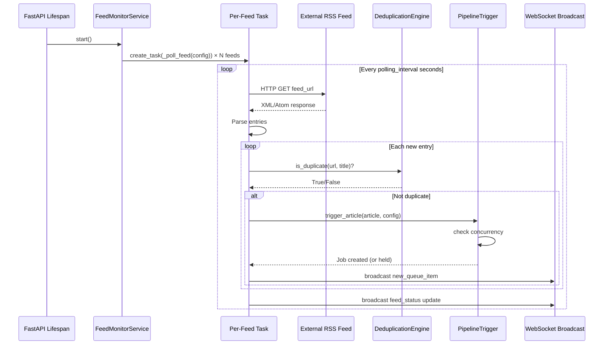

# Design Document: Live Breaking News Mode (RSS Auto-Monitor)

## Overview

Live Breaking News Mode adds an autonomous RSS/news feed monitoring layer to VernacularCast. It continuously polls configured RSS feeds, detects new articles, deduplicates them, and automatically triggers the existing article-to-video pipeline to produce regional language news videos without manual intervention.

The system integrates alongside the existing `Job` pipeline — it does not replace or modify the current scrape → script → TTS → video flow. Instead, it acts as an automated "job submitter" that feeds articles into the pipeline based on configurable rules, priority keywords, and trust levels.

### Key Design Decisions

1. **Asyncio-native background service**: The feed monitor runs as asyncio tasks within the same FastAPI process (no external task queue like Celery). This keeps deployment simple and aligns with the existing `asyncio.create_task(run_pipeline(job_id))` pattern.

2. **SQLite-backed state**: All feed configurations, fingerprints, and queue state use SQLModel tables in the existing `vernacularcast.db`. WAL mode and busy timeout are already configured.

3. **Extended WebSocket manager**: A new "broadcast channel" concept is added alongside the existing per-job WebSocket. Dashboard clients subscribe to a `ws/live-news` channel for real-time feed health and queue updates.

4. **Existing Job model reused**: Auto-triggered jobs are standard `Job` records with a `live_news` origin tag and `feed_config_id` reference stored in `brand_data` JSON. No schema changes to the Job table itself.

---

## Architecture

```mermaid
graph TB
    subgraph Frontend
        Dashboard[Live News Dashboard]
        ApprovalQueue[Approval Queue]
        FeedConfig[Feed Config UI]
    end

    subgraph Backend
        API[FastAPI Routes<br/>/api/feeds/*<br/>/api/live-news/*]
        FeedMonitor[FeedMonitorService<br/>asyncio background tasks]
        DedupEngine[DeduplicationEngine]
        PipelineTrigger[PipelineTrigger]
        ExistingPipeline[Existing Pipeline<br/>scrape→script→TTS→video]
        WSManager[WebSocket Manager<br/>per-job + broadcast channel]
    end

    subgraph Storage
        DB[(SQLite DB<br/>feed_configuration<br/>article_fingerprint<br/>approval_queue_item)]
        RSSFeeds[External RSS Feeds]
    end

    FeedConfig -->|CRUD| API
    Dashboard -->|GET stats, WS| API
    ApprovalQueue -->|approve/reject| API

    API -->|start/pause/resume| FeedMonitor
    FeedMonitor -->|poll RSS| RSSFeeds
    FeedMonitor -->|check| DedupEngine
    DedupEngine -->|query/insert| DB
    FeedMonitor -->|new article| PipelineTrigger
    PipelineTrigger -->|create Job| ExistingPipeline
    PipelineTrigger -->|concurrency check| DB

    FeedMonitor -->|status updates| WSManager
    ExistingPipeline -->|job progress| WSManager
    WSManager -->|real-time| Dashboard
    WSManager -->|real-time| ApprovalQueue
```



### Component Responsibilities

| Component | Responsibility |
|-----------|---------------|
| `FeedMonitorService` | Manages per-feed polling tasks, handles lifecycle (start/pause/stop), implements backoff on errors |
| `DeduplicationEngine` | Computes URL-based fingerprints, performs title similarity checks, manages retention |
| `PipelineTrigger` | Creates Job records, enforces concurrency limits, assigns priority |
| `LiveNewsBroadcastManager` | Extends `ws_manager` with a broadcast channel for dashboard clients |
| `FeedCRUD Routes` | REST endpoints for feed configuration management |
| `LiveNewsRoutes` | Dashboard stats, approval actions, monitoring lifecycle controls |

---

## Components and Interfaces

### Backend Services

#### FeedMonitorService (`backend/app/services/feed_monitor.py`)

```python
class FeedMonitorService:
    """Singleton service managing all feed polling tasks."""

    state: MonitorState  # "active" | "paused" | "stopped"
    _tasks: dict[int, asyncio.Task]  # feed_config_id → polling task
    _failure_counts: dict[int, int]  # feed_config_id → consecutive failures

    async def start() -> None
    async def pause() -> None
    async def resume() -> None
    async def stop() -> None

    async def add_feed(config: FeedConfiguration) -> None
    async def remove_feed(feed_id: int) -> None
    async def update_feed(config: FeedConfiguration) -> None

    async def _poll_feed(config: FeedConfiguration) -> None
    async def _handle_new_articles(config: FeedConfiguration, entries: list[RSSEntry]) -> None
```

#### DeduplicationEngine (`backend/app/services/dedup_engine.py`)

```python
class DeduplicationEngine:
    """Stateless service that checks articles against stored fingerprints."""

    def compute_fingerprint(url: str) -> str
    def normalize_title(title: str) -> str
    async def is_duplicate(url: str, title: str) -> bool
    async def record_article(url: str, title: str, feed_config_id: int) -> ArticleFingerprint
    async def cleanup_expired(retention_days: int = 7) -> int
```

#### PipelineTrigger (`backend/app/services/pipeline_trigger.py`)

```python
class PipelineTrigger:
    """Creates and queues jobs from detected articles."""

    MAX_CONCURRENT_JOBS: int = 5
    MAX_PENDING_JOBS: int = 10

    async def should_hold() -> bool
    async def trigger_article(article: DetectedArticle, config: FeedConfiguration) -> Job | None
    async def get_active_job_count() -> int
    def assign_priority(article: DetectedArticle, config: FeedConfiguration) -> str
```

### API Routes

#### Feed Configuration CRUD (`/api/feeds`)

| Method | Endpoint | Description |
|--------|----------|-------------|
| `GET` | `/api/feeds` | List all feed configurations |
| `GET` | `/api/feeds/{id}` | Get single feed configuration |
| `POST` | `/api/feeds` | Create new feed configuration |
| `PUT` | `/api/feeds/{id}` | Update feed configuration |
| `DELETE` | `/api/feeds/{id}` | Delete feed (soft delete, retains history) |
| `POST` | `/api/feeds/{id}/validate` | Validate RSS URL is reachable and parseable |

#### Monitoring Lifecycle (`/api/live-news`)

| Method | Endpoint | Description |
|--------|----------|-------------|
| `GET` | `/api/live-news/status` | Get monitor state + aggregate stats |
| `POST` | `/api/live-news/start` | Activate monitoring system |
| `POST` | `/api/live-news/pause` | Pause all polling |
| `POST` | `/api/live-news/resume` | Resume polling |
| `POST` | `/api/live-news/stop` | Stop monitoring completely |

#### Dashboard & Approval (`/api/live-news`)

| Method | Endpoint | Description |
|--------|----------|-------------|
| `GET` | `/api/live-news/dashboard` | Real-time metrics (feeds, queue depth, etc.) |
| `GET` | `/api/live-news/queue` | Approval queue items (paginated, sorted) |
| `POST` | `/api/live-news/queue/{job_id}/approve` | Approve auto-generated video |
| `POST` | `/api/live-news/queue/{job_id}/reject` | Reject with reason |
| `GET` | `/api/live-news/feeds/{id}/articles` | Recent articles from a specific feed |

#### WebSocket

| Endpoint | Description |
|----------|-------------|
| `ws/live-news` | Broadcast channel for dashboard updates (feed status, new queue items, breaking alerts) |

### Frontend Components

#### Pages

- **`LiveNewsDashboard.tsx`** — Main monitoring page with stat cards, per-feed health list, and quick actions
- **`ApprovalQueue.tsx`** — Queue of auto-generated videos with preview, approve/reject controls
- **`FeedConfigPage.tsx`** — CRUD interface for managing RSS feed sources

#### Components

- **`FeedStatusCard.tsx`** — Shows feed name, health indicator, last polled time, article count
- **`BreakingAlert.tsx`** — Toast/banner when high-priority article detected
- **`MonitorControls.tsx`** — Start/Pause/Resume/Stop buttons with state display
- **`QueueItem.tsx`** — Single approval queue entry with video preview, source info, approve/reject buttons
- **`FeedForm.tsx`** — Form for creating/editing feed configurations with URL validation

#### Zustand Store (`liveNewsStore.ts`)

```typescript
interface LiveNewsStore {
  monitorState: 'active' | 'paused' | 'stopped'
  feeds: FeedConfiguration[]
  dashboardStats: LiveNewsDashboardStats
  queueItems: QueueItem[]
  wsConnected: boolean

  setMonitorState: (state: MonitorState) => void
  setFeeds: (feeds: FeedConfiguration[]) => void
  updateFeedStatus: (feedId: number, status: FeedHealthStatus) => void
  addQueueItem: (item: QueueItem) => void
  removeQueueItem: (jobId: number) => void
  setDashboardStats: (stats: LiveNewsDashboardStats) => void
}
```

---

## Data Models

### FeedConfiguration (SQLModel)

```python
class FeedConfiguration(SQLModel, table=True):
    __tablename__ = "feed_configuration"

    id: Optional[int] = Field(default=None, primary_key=True)
    feed_url: str = Field(index=True)               # RSS/Atom feed URL
    display_name: str                                 # Human-readable name
    polling_interval_seconds: int = Field(default=300)  # Min 60
    language: str = Field(default="en-IN")           # ta-IN | hi-IN | te-IN | kn-IN | en-IN
    priority_keywords: str = Field(default="")       # Comma-separated keywords
    trust_level: str = Field(default="standard")     # trusted | standard | untrusted
    auto_approve: bool = Field(default=False)        # Auto-approve policy
    enabled: bool = Field(default=True)
    created_at: datetime = Field(default_factory=datetime.utcnow)
    updated_at: datetime = Field(default_factory=datetime.utcnow)

    # Runtime state (not user-editable)
    health_status: str = Field(default="active")     # active | degraded | error
    consecutive_failures: int = Field(default=0)
    last_polled_at: Optional[datetime] = Field(default=None)
    last_successful_poll: Optional[datetime] = Field(default=None)
    articles_processed: int = Field(default=0)
    current_polling_interval: int = Field(default=300)  # May be doubled on 429
```

### ArticleFingerprint (SQLModel)

```python
class ArticleFingerprint(SQLModel, table=True):
    __tablename__ = "article_fingerprint"

    id: Optional[int] = Field(default=None, primary_key=True)
    url_hash: str = Field(index=True)                # SHA-256 of normalized URL
    title_normalized: str = Field(index=True)         # Lowercased, stripped title
    original_url: str                                  # Original article URL
    original_title: str                                # Original article title
    feed_config_id: int = Field(foreign_key="feed_configuration.id")
    job_id: Optional[int] = Field(default=None)       # Associated Job if triggered
    detected_at: datetime = Field(default_factory=datetime.utcnow)
    status: str = Field(default="processed")          # processed | skipped_duplicate
    expires_at: datetime                               # detected_at + retention_days
```

### Pydantic Schemas (API request/response)

```python
class FeedConfigCreate(SQLModel):
    feed_url: str
    display_name: str
    polling_interval_seconds: int = 300
    language: str = "en-IN"
    priority_keywords: str = ""
    trust_level: str = "standard"
    auto_approve: bool = False
    enabled: bool = True

class FeedConfigRead(SQLModel):
    id: int
    feed_url: str
    display_name: str
    polling_interval_seconds: int
    language: str
    priority_keywords: str
    trust_level: str
    auto_approve: bool
    enabled: bool
    health_status: str
    consecutive_failures: int
    last_polled_at: Optional[datetime]
    articles_processed: int
    current_polling_interval: int
    created_at: datetime

class FeedConfigUpdate(SQLModel):
    display_name: Optional[str] = None
    polling_interval_seconds: Optional[int] = None
    language: Optional[str] = None
    priority_keywords: Optional[str] = None
    trust_level: Optional[str] = None
    auto_approve: Optional[bool] = None
    enabled: Optional[bool] = None

class LiveNewsDashboardStats(SQLModel):
    monitor_state: str                    # active | paused | stopped
    total_active_feeds: int
    degraded_feeds: int
    articles_detected_last_hour: int
    videos_awaiting_review: int
    videos_auto_approved_last_hour: int
    active_processing_jobs: int

class DetectedArticle(SQLModel):
    title: str
    url: str
    published_at: Optional[datetime] = None
    summary: Optional[str] = None
    feed_config_id: int

class QueueItemRead(SQLModel):
    job_id: int
    article_title: str
    article_url: str
    feed_name: str
    language: str
    priority: str                          # high | standard
    status: str                            # awaiting_review | approved | rejected
    created_at: datetime
    video_path: Optional[str] = None
    rejection_reason: Optional[str] = None
```

### TypeScript Types (Frontend)

```typescript
interface FeedConfiguration {
  id: number
  feed_url: string
  display_name: string
  polling_interval_seconds: number
  language: Language
  priority_keywords: string
  trust_level: 'trusted' | 'standard' | 'untrusted'
  auto_approve: boolean
  enabled: boolean
  health_status: 'active' | 'degraded' | 'error'
  consecutive_failures: number
  last_polled_at: string | null
  articles_processed: number
  current_polling_interval: number
  created_at: string
}

interface LiveNewsDashboardStats {
  monitor_state: 'active' | 'paused' | 'stopped'
  total_active_feeds: number
  degraded_feeds: number
  articles_detected_last_hour: number
  videos_awaiting_review: number
  videos_auto_approved_last_hour: number
  active_processing_jobs: number
}

interface QueueItem {
  job_id: number
  article_title: string
  article_url: string
  feed_name: string
  language: string
  priority: 'high' | 'standard'
  status: 'awaiting_review' | 'approved' | 'rejected'
  created_at: string
  video_path: string | null
  rejection_reason: string | null
}

type MonitorState = 'active' | 'paused' | 'stopped'

interface LiveNewsWSMessage {
  type: 'feed_status' | 'new_queue_item' | 'breaking_alert' | 'stats_update' | 'monitor_state'
  payload: unknown
}
```

---

### Background Service Architecture

The `FeedMonitorService` runs as a singleton within the FastAPI lifespan. On startup (if previously active), it spawns one `asyncio.Task` per enabled feed.



### Staggered Startup

To avoid burst traffic, feeds are started with staggered delays:

```python
for i, config in enumerate(enabled_feeds):
    await asyncio.sleep(i * 2)  # 2-second stagger between feeds
    self._tasks[config.id] = asyncio.create_task(self._poll_feed(config))
```

### Failure Handling & Backoff

- Consecutive failures tracked per feed
- After 5 consecutive failures → mark feed as "degraded", emit WebSocket alert
- HTTP 429 → double `current_polling_interval` (capped at 1 hour)
- Successful poll after degraded → reset counter, restore original interval

### Concurrency Control

The `PipelineTrigger` enforces two limits:
1. **Max concurrent pipeline jobs**: 5 (jobs in scraping/generating/rendering states)
2. **Max pending queue depth**: 10 (jobs in pending state waiting to start)

When limits are hit, new articles are held in a `waiting` state in the `ArticleFingerprint` table and re-evaluated on the next poll cycle.

### Deduplication Strategy

Two-layer deduplication:

1. **URL-based** (primary): SHA-256 hash of normalized URL (lowercased, stripped of tracking params like `utm_*`, `ref`, `fbclid`)
2. **Title-based** (secondary): Normalized title comparison (lowercase, strip punctuation, collapse whitespace). If two articles from different feeds have >90% title similarity (using `difflib.SequenceMatcher`), the later one is marked as duplicate.

Fingerprints expire after 7 days (configurable) to allow legitimate re-coverage of evolving stories.

### WebSocket Integration

A new `LiveNewsBroadcastManager` extends the existing pattern:

```python
class LiveNewsBroadcastManager:
    """Manages connections for the /ws/live-news channel."""
    
    active_connections: list[WebSocket]

    async def connect(websocket: WebSocket) -> None
    def disconnect(websocket: WebSocket) -> None
    async def broadcast(message: LiveNewsWSMessage) -> None
```

Message types:
- `feed_status` — health/polling state changed for a feed
- `new_queue_item` — new video entered the approval queue
- `breaking_alert` — high-priority keyword match detected
- `stats_update` — dashboard metric changed
- `monitor_state` — global monitor state changed (active/paused/stopped)

---

## Correctness Properties

*A property is a characteristic or behavior that should hold true across all valid executions of a system — essentially, a formal statement about what the system should do. Properties serve as the bridge between human-readable specifications and machine-verifiable correctness guarantees.*

### Property 1: Feed configuration storage round-trip

*For any* valid `FeedConfigCreate` input (with `polling_interval_seconds >= 60`, valid language, valid trust_level), creating the configuration and then reading it back should yield a record with all input fields preserved exactly.

**Validates: Requirements 1.1**

### Property 2: Polling interval minimum enforcement

*For any* integer value less than 60, attempting to create or update a `FeedConfiguration` with that `polling_interval_seconds` should be rejected with a validation error.

**Validates: Requirements 1.4, 10.1**

### Property 3: Invalid URL rejection

*For any* string that is not a syntactically valid HTTP/HTTPS URL (missing scheme, empty string, non-URL text), submitting it as a `feed_url` should return a descriptive validation error.

**Validates: Requirements 1.5**

### Property 4: RSS entry parsing extracts all required fields

*For any* valid RSS/Atom entry containing a title, link, publication date, and description/summary, the feed parser should extract all four fields into a `DetectedArticle` with non-null `title`, `url`, `published_at`, and `summary`.

**Validates: Requirements 2.2**

### Property 5: Failure counter monotonic increment

*For any* `FeedConfiguration` with `consecutive_failures = N`, after a failed poll attempt, `consecutive_failures` should equal `N + 1`.

**Validates: Requirements 2.3**

### Property 6: URL fingerprint determinism and normalization

*For any* URL, `compute_fingerprint` should be deterministic (same URL always produces the same hash). Furthermore, *for any* two URLs that differ only by tracking parameters (`utm_source`, `utm_medium`, `utm_campaign`, `fbclid`, `ref`), `compute_fingerprint` should produce the same hash.

**Validates: Requirements 3.1**

### Property 7: Deduplication round-trip

*For any* article URL and title, after calling `record_article(url, title)`, calling `is_duplicate(url, title)` should return `True`.

**Validates: Requirements 3.2**

### Property 8: Fingerprint retention and expiry

*For any* `ArticleFingerprint` with `detected_at` more than `retention_days` (default 7) in the past, `cleanup_expired` should remove it. *For any* fingerprint with `detected_at` within the retention window, `cleanup_expired` should retain it.

**Validates: Requirements 3.3**

### Property 9: Title normalization deduplication

*For any* two title strings that normalize to the same value (after lowercasing, stripping punctuation, and collapsing whitespace), if the first is recorded via `record_article`, then `is_duplicate` for the second should return `True` (regardless of differing URLs).

**Validates: Requirements 3.4**

### Property 10: Triggered job correctness

*For any* valid `DetectedArticle` and `FeedConfiguration`, when `trigger_article` creates a Job, that Job should have `mode="article"`, `article_url` equal to the article's URL, `language` equal to the feed config's language, and `brand_data` JSON containing `feed_config_id` matching the config's ID and `origin="live_news"`.

**Validates: Requirements 4.1, 4.4**

### Property 11: Publication-date ordering

*For any* list of `DetectedArticle` objects with distinct `published_at` timestamps, after processing by `PipelineTrigger`, the resulting Jobs should be created in descending order of `published_at` (newest first).

**Validates: Requirements 4.2**

### Property 12: Concurrency throttling (pending queue)

*For any* system state where the count of jobs with status in `{pending, scraping, generating_script, generating_voice, rendering_video}` is >= `MAX_PENDING_JOBS` (10), calling `trigger_article` should return `None` (article held, no job created).

**Validates: Requirements 4.3**

### Property 13: Concurrency throttling (active pipeline)

*For any* system state where the count of jobs with status in `{scraping, generating_script, generating_voice, rendering_video}` is >= `MAX_CONCURRENT_JOBS` (5), calling `trigger_article` should hold the article without creating a new pipeline job.

**Validates: Requirements 10.2**

### Property 14: Priority assignment by keyword presence

*For any* article and feed configuration, if the article's title or summary contains at least one keyword from the feed's `priority_keywords` (case-insensitive), `assign_priority` should return `"high"`. If no keywords match, it should return `"standard"`.

**Validates: Requirements 5.1, 5.2, 5.3**

### Property 15: Queue item completeness

*For any* Job in `awaiting_review` status that was triggered by the live-news system, the corresponding `QueueItemRead` should have non-null `article_title`, `feed_name`, `language`, `created_at`, and `priority` fields.

**Validates: Requirements 6.1**

### Property 16: Approval state transition

*For any* Job with status `awaiting_review`, after approval, the Job's status should equal `"approved"`.

**Validates: Requirements 6.2**

### Property 17: Rejection state transition with reason

*For any* Job with status `awaiting_review` and any non-empty rejection reason string, after rejection, the Job's status should equal `"rejected"` and the recorded rejection reason should match the provided string.

**Validates: Requirements 6.3**

### Property 18: Queue sorting — priority then recency

*For any* set of queue items with mixed priorities and creation times, the sorted queue output should have all `"high"` priority items before all `"standard"` priority items, and within each priority group, items should be sorted by `created_at` descending (newest first).

**Validates: Requirements 6.4**

### Property 19: Auto-approve for trusted sources

*For any* `FeedConfiguration` with `trust_level="trusted"` and `auto_approve=True`, videos generated from that feed should automatically receive status `"approved"` without requiring manual review.

**Validates: Requirements 6.5, 7.1**

### Property 20: Auto-approval audit logging

*For any* auto-approved Job, the job's steps should contain an audit entry recording the auto-approval event with the source feed name and article URL.

**Validates: Requirements 7.2**

### Property 21: Dashboard stats accuracy

*For any* database state containing N active feeds, M degraded feeds, P jobs in `awaiting_review`, and Q active pipeline jobs, the `LiveNewsDashboardStats` response should report `total_active_feeds=N`, `degraded_feeds=M`, `videos_awaiting_review=P`, and `active_processing_jobs=Q`.

**Validates: Requirements 8.1**

### Property 22: HTTP 429 backoff doubling

*For any* `FeedConfiguration` with `current_polling_interval = X`, after receiving an HTTP 429 response, `current_polling_interval` should equal `min(X * 2, 3600)` (capped at 1 hour).

**Validates: Requirements 10.3**

### Property 23: Deletion retains article history

*For any* `FeedConfiguration` that has associated `ArticleFingerprint` records, after the feed is deleted, those `ArticleFingerprint` records should still exist in the database.

**Validates: Requirements 1.3**

---

## Error Handling

### Feed Polling Errors

| Error | Handling | Recovery |
|-------|----------|----------|
| HTTP 4xx (non-429) | Log error, increment failure counter | Retry on next cycle |
| HTTP 429 | Log, double polling interval, increment counter | Reset interval on success |
| HTTP 5xx | Log error, increment failure counter | Retry on next cycle |
| Connection timeout | Log, increment failure counter | Retry on next cycle |
| Malformed XML/RSS | Log parsing error, increment failure counter | Retry on next cycle |
| 5 consecutive failures | Mark feed as `degraded`, emit WebSocket alert | Auto-recover on next success |

### Pipeline Trigger Errors

| Error | Handling |
|-------|----------|
| Job creation fails (DB error) | Log error, article remains unprocessed (will retry next poll if fingerprint not yet saved) |
| Concurrency limit hit | Article held in waiting state, no error surfaced |
| Invalid article data (no URL/title) | Skip article, log warning |

### Validation Errors

| Input | Validation | Error Response |
|-------|-----------|----------------|
| `feed_url` | Must be valid HTTP/HTTPS URL | 422: "Invalid feed URL: must be an HTTP or HTTPS URL" |
| `polling_interval_seconds` | Must be >= 60 | 422: "Polling interval must be at least 60 seconds" |
| `language` | Must be in `{ta-IN, hi-IN, te-IN, kn-IN, en-IN}` | 422: "Unsupported language: {value}" |
| `trust_level` | Must be in `{trusted, standard, untrusted}` | 422: "Invalid trust level: must be trusted, standard, or untrusted" |

### Graceful Degradation

- If the entire monitoring service crashes, the FastAPI lifespan restart will recover it
- Stuck articles (fingerprint saved but job never created) are retried via periodic cleanup task
- WebSocket disconnections are handled silently; clients reconnect automatically
- Database WAL mode ensures concurrent reads don't block the polling tasks

---

## Testing Strategy

### Property-Based Tests (fast-check / Hypothesis)

The feature is well-suited to property-based testing because it involves:
- Pure data transformation functions (fingerprinting, normalization, priority assignment)
- Universal validation rules (polling interval bounds, URL validation)
- State machine logic (queue ordering, concurrency throttling)
- Round-trip properties (record → check duplicate)

**Library**: `hypothesis` (Python) for backend property tests.

**Configuration**: Minimum 100 iterations per property test.

**Tag format**: `Feature: live-breaking-news, Property {number}: {property_text}`

Each correctness property (1–23) maps to one property-based test. These tests should exercise the pure logic layer with generated inputs, using mocks for database and WebSocket dependencies.

### Unit Tests (example-based)

- Feed creation/update/delete CRUD operations with specific examples
- Degraded state transition after exactly 5 failures
- Recovery from degraded state on success
- Auto-approve policy toggle behavior
- WebSocket message format verification
- RSS XML parsing edge cases (missing fields, CDATA, namespaced elements)

### Integration Tests

- End-to-end feed polling with a mock HTTP server serving RSS XML
- WebSocket broadcast verification on state changes
- Pipeline trigger → Job creation → pipeline execution flow
- Feed lifecycle (start → pause → resume → stop) with timing verification
- Staggered startup timing verification

### Frontend Tests

- Component rendering for `FeedStatusCard`, `QueueItem`, `MonitorControls`
- Zustand store state transitions
- WebSocket reconnection behavior
- Approval/rejection UI flow
- Feed configuration form validation

